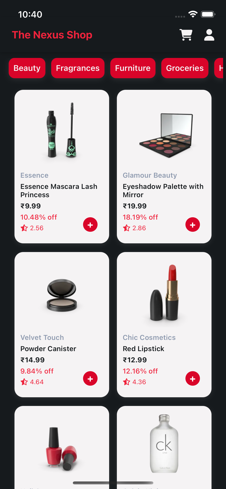
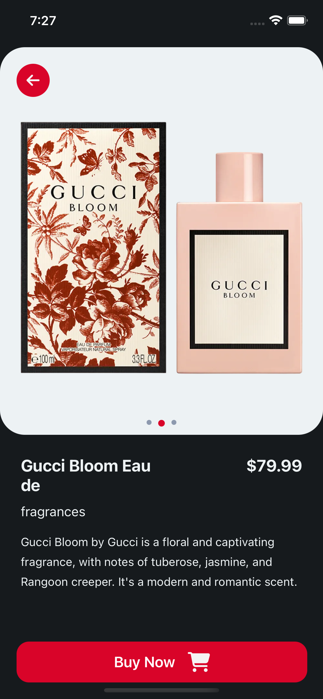
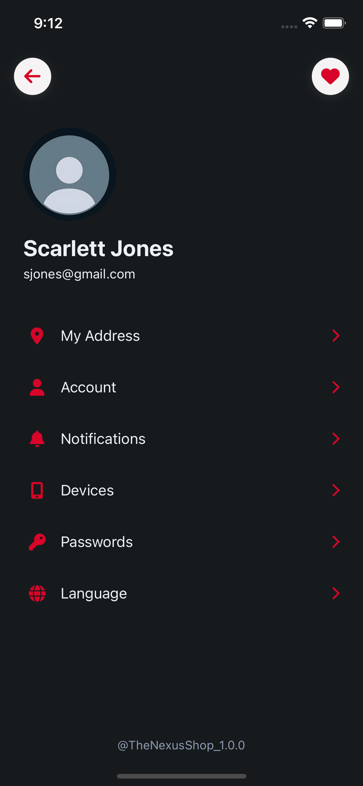
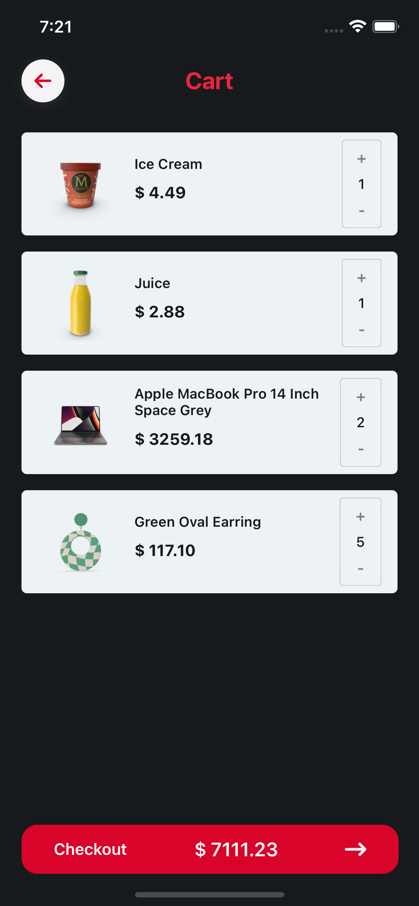

# 🛍️ NexusShop

NexusShop is a modern mobile **shopping application** built with [React Native](https://reactnative.dev/) that provides a smooth, cross-platform shopping experience for Android and iOS users. 🛒


> ✨ **Logo Created & Animated using Adobe Express**

## 📱 Screenshots

<table>
  <tr>
    <td align="center">
      
      <br>Splash
    </td>
    <td align="center">
      
      <br>Signup
    </td>
    <td align="center">
      
      <br>Home Screen
    </td>
  </tr>
  <tr>
    <td align="center">
      
      <br>Product Details
    </td>
    <td align="center">
      
      <br>Profile
    </td>
    <td align="center">
      
      <br>Cart
    </td>
  </tr>
</table>


NexusShop offers a clean, intuitive shopping experience with features like:

- 🔒 User authentication
- 🔎 Product browsing
- 💳 Add to cart   
- 🎨 Custom UI with theming and animations  
- 🌐 Backend powered via REST APIs

## 🛠️ Tech Stack

| Category        | Tech Used                                         |
|------------------|---------------------------------------------------|
| **Framework**     | React Native (`@react-native-community/cli`)    |
| **State Management** | Redux & Redux Toolkit                         |
| **Routing**       | React Navigation                                 |
| **APIs**          | Fetch API (REST API integration)                     |
| **UI/Components** | React Native Paper, Vector Icons                |
| **Animations**    | Lottie/Animated + Adobe Express animations       |
| **Authentication** | Token-based (JWT) & Secure Store                |
| **OS Support**    | Android & iOS (Simulators & Devices)             |

## 🎨 Logo & Branding

The official **NexusShop logo was custom created and animated** using **Adobe Express**, incorporating a smooth shopping bag + cart transition to match the theme of the app.


## 🚀 Getting Started

### 📦 Prerequisites

- 📱 React Native CLI setup guide: [React Native Environment Setup](https://reactnative.dev/docs/environment-setup)
- Node.js, npm/yarn
- Android Studio or Xcode for emulators

### 🔧 Installation

```bash
git clone https://github.com/VaunshikaG/NexusShop.git
cd NexusShop

# install dependencies
npm install   # or yarn

# start Metro bundler
npm start     # or yarn start
```

#### ✅ Platform Setup

| Platform | Command            |
|----------|--------------------|
| Android  | `npm run android`  |
| iOS      | `cd ios && pod install && cd ..`then `npm run ios` |

## 🧠 Project Structure

```
NexusShop/
├── assets/                   # Images, fonts, animation assets
├── src
  ├── components/               # UI components
  ├── redux/                    # Redux Toolkit slices & store
  ├── screens/                  # App screens
  ├── services/                 # API and business logic
  ├── utils/                    # Theming, constants, helpers
  ├── App.tsx                   # Entry component
  ├── AppNavigation.tsx         # Routes & navigators
└── ...
```

## 🗃️ Features

✅ User Authentication (login/signup)  
✅ Product Catalog with Paginated Listings  
✅ Add to Cart, View Cart  
✅ Profile Management  
✅ Responsive UI  
✅ Carousel image viewer with pagination dots  
✅ Logo splash/intro animation


## 🛠 Developer Tools

- **VS Code**
- **Adobe Express** (Logo creation/animation)
- **Postman** (API testing)
- GitHub (Version Control)


## 🐛 Troubleshooting Notes

If you're facing issues:


- **Metro bundler stuck or crashing:**

```bash
npx react-native start --reset-cache
```

- **iOS CocoaPods error:**

```bash
cd ios && pod install && cd ..
```

- **Rebuild from scratch:**

```bash
watchman watch-del-all
rm -rf node_modules ios/Pods ios/Podfile.lock
npm install
cd ios && pod install && cd ..
npx react-native run-ios # or run-android
```

## 📜 License

[MIT](./LICENSE)

## 🙋‍♀️ Author

Made by [Vaunshika Gogarkar](https://github.com/VaunshikaG)
